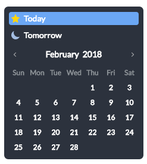

Calendar
========

[![License][license-image]][license-url]

### A refreshing React Datepicker

  

[license-image]: https://img.shields.io/:license-mit-blue.svg?style=flat-square
[license-url]: LICENSE.md